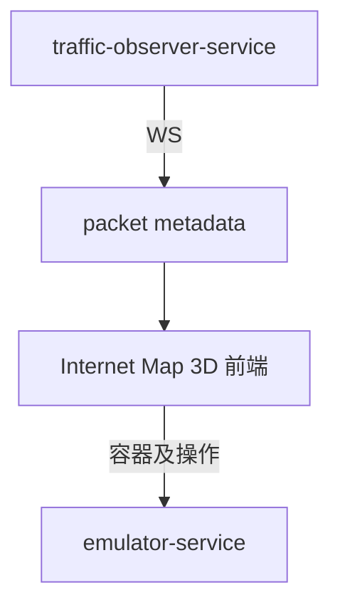

# internet-map-3d

`internet-map-3d` 是独立的 Internet Map 3D 前端项目，对应 Docker Compose 服务 `internet-map-3d`。

## 和其它服务的关系

## 说明

- 容器操作和节点信息仍由 `emulator-service` 提供。
- Docker Compose 默认通过 `http://localhost:8090` 暴露该前端。
- 如果展示实时 packet 流动，则订阅 `traffic-observer-service` 的 packet WebSocket。

## 测试覆盖

Mermaid 测试覆盖图见 [internet-map-3d-testing.md](./test/internet-map-3d-testing.md)。
