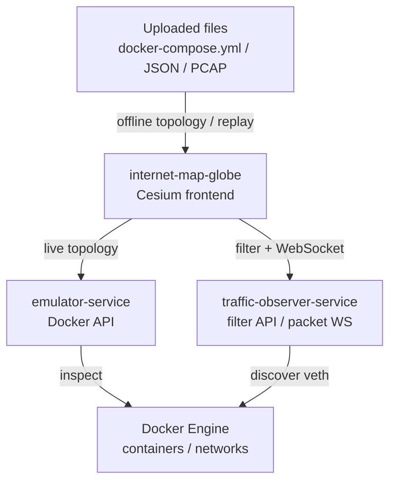

# Internet Map Globe

`internet-map-globe` 是 SEED Emulator / Docker Compose 拓扑的 Cesium 可视化前端。它同时提供 3D 地球视图和 2D 平铺地图视图，用于展示 IX、普通网络、Router、Host 和拓扑链路，并支持实时抓包播放或离线 JSON / PCAP 回放。

## 页面入口

生产环境默认端口为 `8090`，根路径前缀来自 `VITE_FRONTEND_URL_PREFIX=/pro`。

- Live 3D topology：`http://localhost:8090/pro/map/3d`
- Live 2D topology：`http://localhost:8090/pro/map/2d`
- Uploaded 3D topology：`http://localhost:8090/pro/upload/3d`
- Uploaded 2D topology：`http://localhost:8090/pro/upload/2d`
- Console：`http://localhost:8090/pro/console`

## Docker Compose 启动

从仓库根目录启动：

```bash
docker compose up --build seedemu_emulator_service seedemu_internet_map_globe
```

如果需要实时抓包播放，同时启动 `seedmu_traffic_observer_service`：

```bash
docker compose up --build seedemu_emulator_service seedemu_internet_map_globe seedmu_traffic_observer_service
```

## 本地开发

```bash
cd internet-map-globe/frontend
pnpm install
pnpm dev
```

开发环境默认使用 `frontend/env/.env.development`，其中：

- `VITE_FRONTEND_URL_PREFIX=/dev`
- `VITE_SERVER_EMULATOR_URL_PREFIX=/emulator/api/v1`
- `VITE_TRAFFIC_OBSERVER_URL_PREFIX=/traffic-observer`

## 数据源

### Live Docker API

- `/map/3d`
- `/map/2d`

实时页面通过 `emulator-service` 获取当前 Docker 容器和网络信息。抓包 filter、WebSocket 数据包事件来自 `traffic-observer-service`。

### Uploaded Docker Compose

- `/upload/3d`
- `/upload/2d`

上传页面解析本地 `docker-compose.yml` 构造拓扑，也可以导入 collector JSON，或导入 JSON + PCAP 后在浏览器中进行离线 filter 和回放。

## 模块关系



## 文档

- [Live topology guide](docs/live-topology.md)
- [Upload topology guide](docs/upload-topology.md)
- [Topology dock guide](docs/topology-dock.md)
- [Basic pages guide](docs/basic-pages.md)
